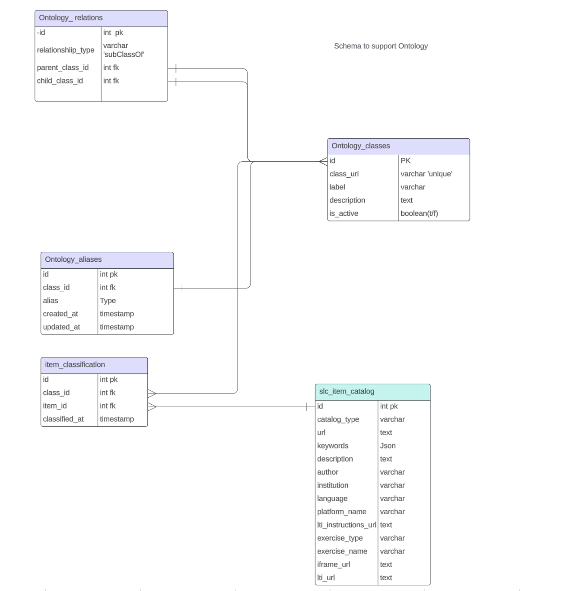

# Database Schema

The database schema supports the classification of content using an ontology. The classifcation is basically organization of the content. The primary tables include `OntologyClasses`, `OntologyRelations`, `ItemClassification`, `SLCItemCatalog`, and `OntologyAliases`. These tables collectively enable structured classification for the content in the catalog.

---

### OntologyClasses
Represents a unique category or concept in the ontology.

| Field         | Type      | Description                              |
|---------------|-----------|------------------------------------------|
| `id`          | INT       | ID the ontology class.                   |
| `class_uri`   | VARCHAR   | URI for the ontology class.              |
| `label`       | VARCHAR   | label for the class.                     |
| `description` | TEXT      | Description of the class.                |
| `is_active`   | BOOLEAN   | Whether the class is active.             |

 

---

### OntologyRelations 
Represents relationships between ontology classes.

| Field             | Type      | Description                                  |
|-------------------|-----------|----------------------------------------------|
| `id`              | INT       | Unique identifier for the relationship.      |
| `parent_class_id` | INT       | Reference to the parent ontology class.      |
| `child_class_id`  | INT       | Reference to the child ontology class.       |
| `relationship_type` | VARCHAR | Type of relationship (`subClassOf`).   |

---

### OntologyAliases
Provides alternative labels for ontology classes.

| Field       | Type      | Description                              |
|-------------|-----------|------------------------------------------|
| `id`        | INT       | Unique identifier for the alias.         |
| `alias`     | VARCHAR   | Alternate name for an ontology class.    |
| `class_id`  | INT       | Reference to the related ontology class. |

---

### SLCItemCatalog
Stores metadata for content items in the catalog.

| Field              | Type       | Description                                  |
|--------------------|------------|----------------------------------------------|
| `id`               | INT        | Unique identifier for the content item.      |
| `catalog_type`     | VARCHAR    | Type of catalog (e.g., "SLCItemCatalog").     |
| `url`              | VARCHAR    | URL where the content is hosted.             |
| `keywords`         | JSON       | List of keywords for the content.            |
| `description`      | TEXT       | Description of the content.                  |
| `author`           | VARCHAR    | Author of the content.                       |
| `institution`      | VARCHAR    | Institution responsible for the content.     |
| `language`         | VARCHAR    | Programming language (if applicable). |
| `platform_name`    | VARCHAR    | Platform hosting the content (e.g., "OpenDSA"). |
| `lti_instructions_url` | VARCHAR | URL for LTI setup instructions.             |
| `exercise_type`    | VARCHAR    | Type of exercise (e.g., "Proficiency Exercise"). |
| `exercise_name`    | VARCHAR    | Title of the exercise for user identification. |
| `iframe_url`       | VARCHAR    | URL for embedding the content in an iframe.  |
| `lti_url`          | VARCHAR    | LTI launch URL for the content.              |

---

### ItemClassification
Links content in the `SLCItemCatalog` table to ontology classes

| Field         | Type      | Description                                  |
|---------------|-----------|----------------------------------------------|
| `id`          | INT       | Unique identifier for the classification.    |
| `classified_at` | TIMESTAMP | Timestamp of the classification.            |
| `item_id`     | INT       | Reference to the item in `SLCItemCatalog`.   |
| `class_id`    | INT       | Reference to the class in `OntologyClasses`. |

---

### ER Diagram

