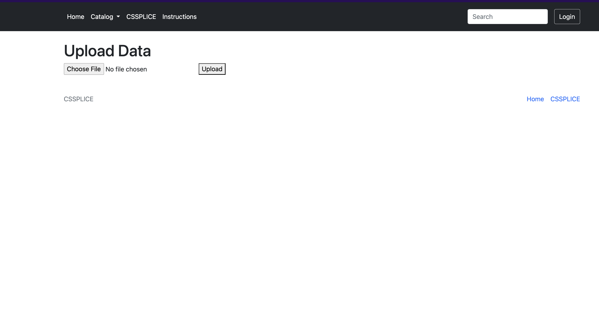
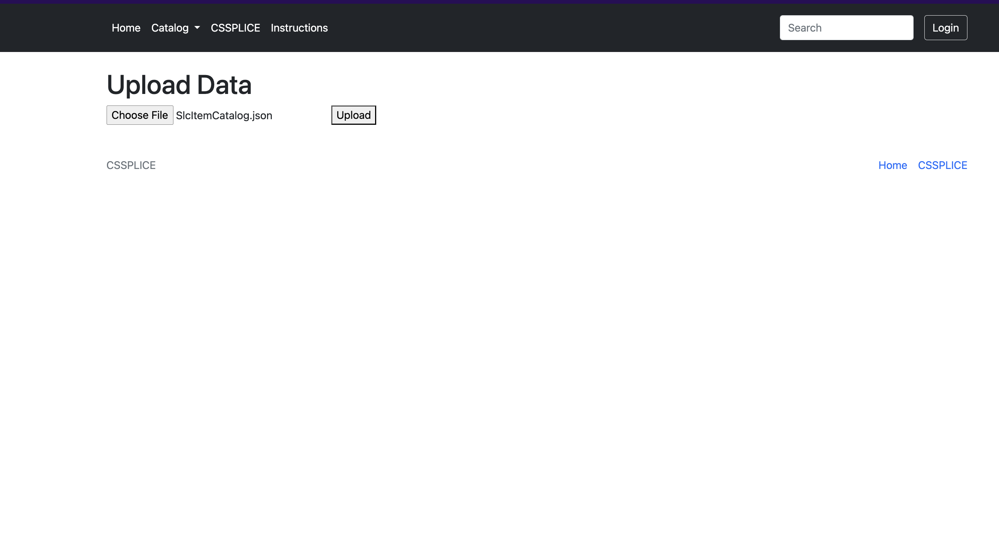
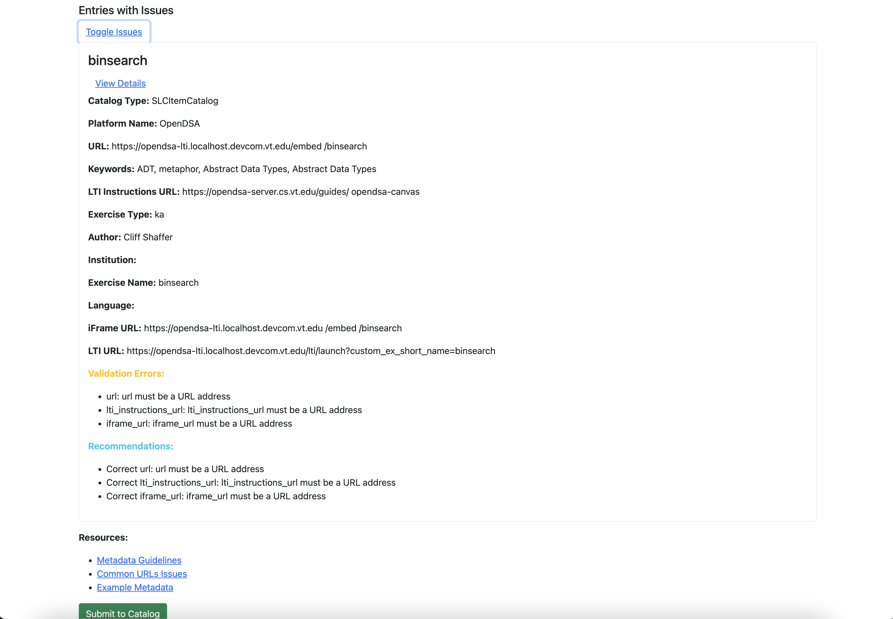
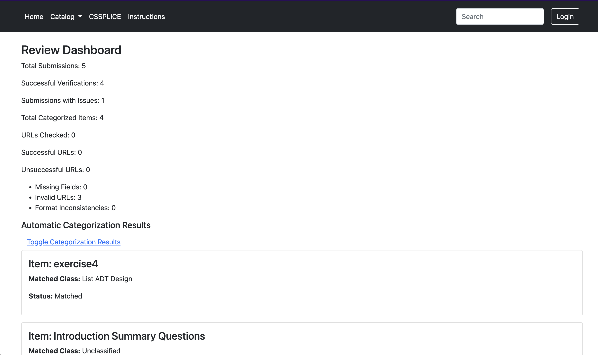
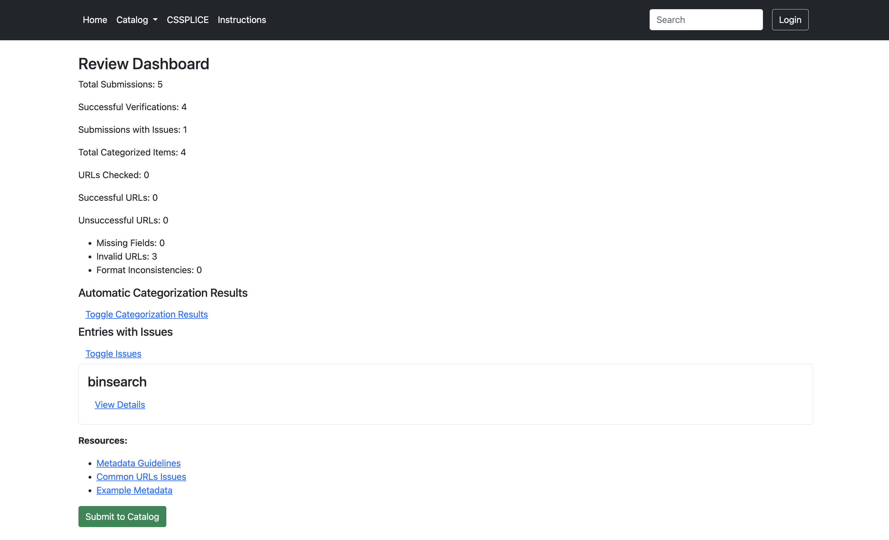

# Testing Guide

This guide provides step-by-step instructions for testing the validation and classification processes within the SPLICE Catalog. This is basically a two-step workflow that contributors use to add content to the catalog:

1. **Using the `/upload` endpoint** – Submit content to the system.
2. **Uploading sample data** – Upload catalog types with provided in sample-data.

---

## 1. Uploading Sample Data

### Endpoint: `/upload`

The `/upload` endpoint is where to submit catalog data for validation and classification. Go to http://localhost:3000/upload/

---

## 2. Sample Data

Refer to the [Sample Data](docs/sample-data) section for JSON sample data for:

- **SLCItemCatalog** – Smart Learning Catalog items.
- **SLCToolsCatalog** – Tool-specific catalog items.

---

**The steps outlined in steps 3 to 5 — validation, classification, and feedback — are automatically triggered once the data is uploaded.**

---

## 3. Validation Process

Once data is uploaded, the system performs comprehensive checks to ensure integrity and accuracy of data.

1. The system validates metadata fields, ensuring:
   - Presence of required fields.
   - Correct data types and formats.
   - Validity of URLs.
2. If validation errors are found, they will be displayed in the review dashboard.

---

## 4. Categorization Process

The process also includes a classifcation process attempts to categorize based on the keywords of contained in the content against the ontology in the catalog.

1. Validated items are matched against the ontology.
2. Keywords and metadata fields are mapped to predefined ontology classes.
3. Items are either classified under relevant categories or marked as "Unclassified" if no match is found.

---

## 5. Reviewing Results

1. Access the review dashboard at [http://localhost:3000/review-dashboard](http://localhost:3000/review-dashboard).
2. Review validation issues and categorized items.

