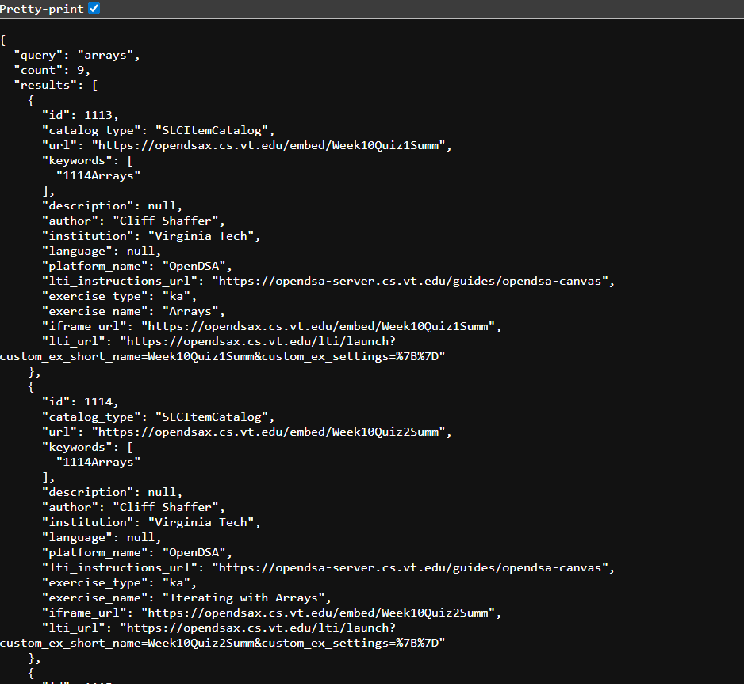

# Search Query API

The SPLICE Catalog previously supported search only through the website interface. Now, we’ve added an API-based search option that lets you search directly via the URL. By visiting https://splice.cs.vt.edu/search/{query}, you can receive a JSON-formatted response with all matching exercises.

For example, accessing https://splice.cs.vt.edu/search/arrays will return results like this: (insert image here).

# Dump API
We've also added a dump endpoint that lets you download search results directly as a JSON file. By visiting https://splice.cs.vt.edu/search/dump/{query}, a JSON file containing the list of matching exercises will be downloaded.

For example, accessing https://splice.cs.vt.edu/search/dump/arrays will download a JSON file with all exercises related to arrays.